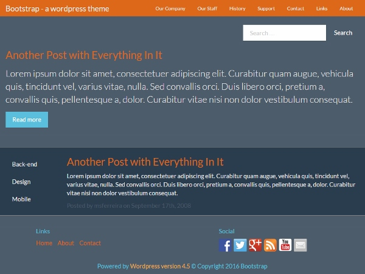
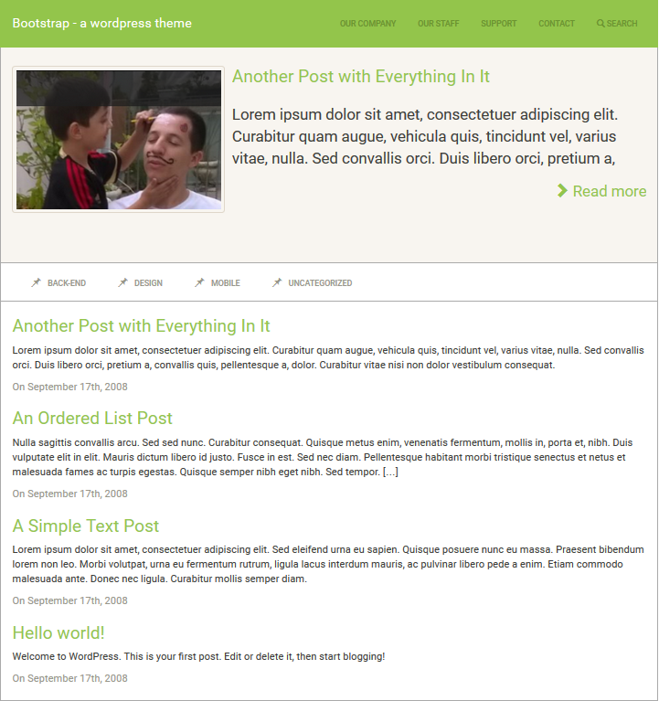

## Screenshot - Layout 1 (branch master)

## Screenshot - Layout 2 (branch 001-layout2)

## Synopsis
A study of Wordpress Theme creation by using Bootstrap

## Apply your Bootstrap
You can download your favorite bootstrap theme from 

https://bootswatch.com/

and apply it (copy to css folder as bootstrap.min.css)

Layout 1 utilizes SuperHero - https://bootswatch.com/superhero/
Layout 2 utilizes Sandstone - https://bootswatch.com/sandstone/

## Important

For the correct navbar behavior you must read

https://github.com/twittem/wp-bootstrap-navwalker
